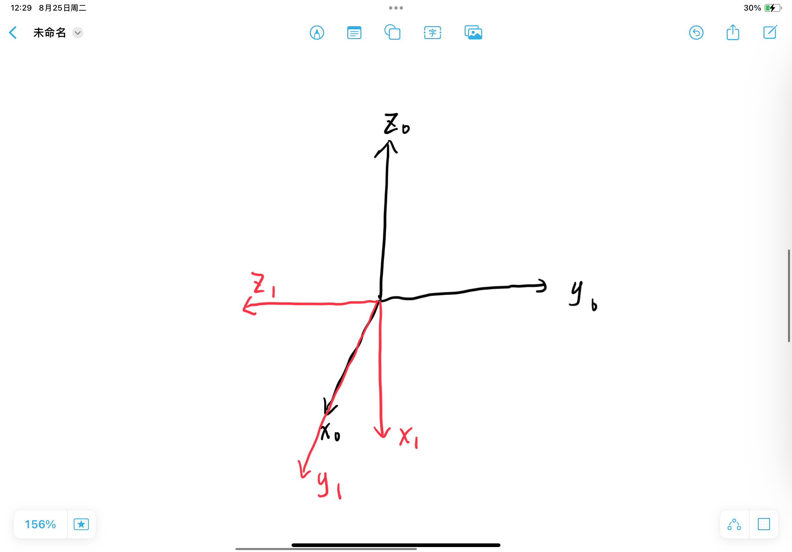
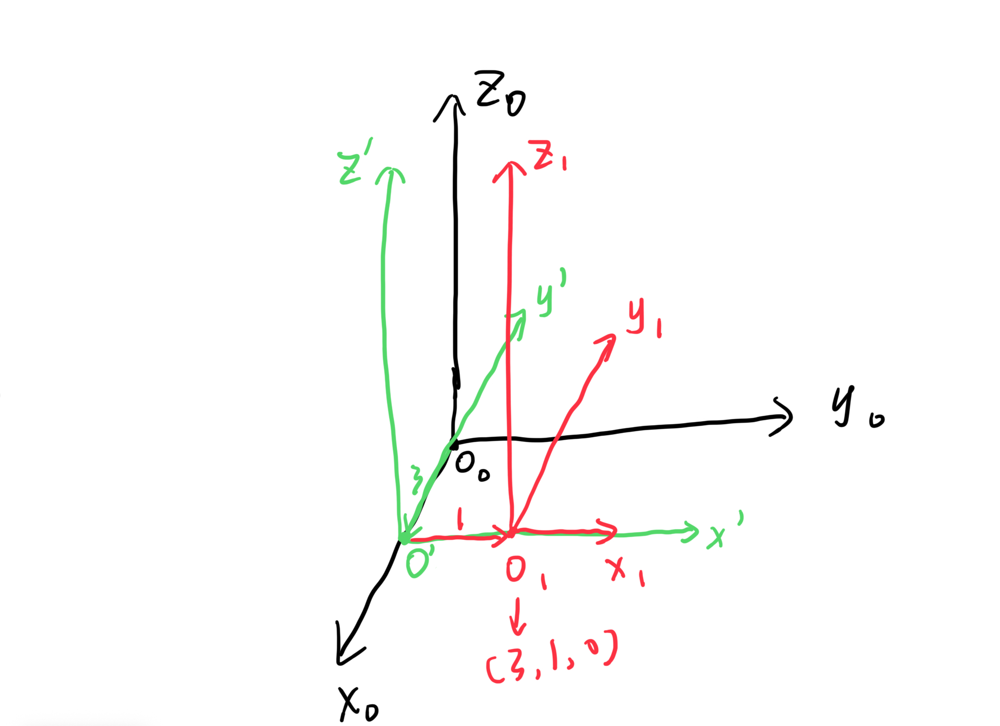

# 齐次变换作业

## 1 基本题

### 1.1

$$
R = R_y(\psi) \cdot R_x(\phi) \cdot R_z(\theta)
$$

### 1.2

$$
R = R_x(\alpha) \cdot R_z(\theta) \cdot R_x(\phi) \cdot R_x(\psi)
$$

### 1.3

基础旋转矩阵：
$$
R_x\left(\frac{\pi}{2}\right) = \begin{bmatrix} 1 & 0 & 0 \\ 0 & 0 & -1 \\ 0 & 1 & 0 \end{bmatrix}, \quad R_y\left(\frac{\pi}{2}\right) = \begin{bmatrix} 0 & 0 & 1 \\ 0 & 1 & 0 \\ -1 & 0 & 0 \end{bmatrix}
$$

合成旋转矩阵：
$$
R = R_y\left(\frac{\pi}{2}\right) \cdot R_x\left(\frac{\pi}{2}\right) = \begin{bmatrix} 0 & 1 & 0 \\ 0 & 0 & -1 \\ -1 & 0 & 0 \end{bmatrix}
$$

### 1.4
由 $R_3^1 = R_2^1 \cdot R_3^2$ 可推出
$$
R_3^2 = \left(R_2^1\right)^T \cdot R_3^1
$$

代入：
$$
\left(R_2^1\right)^T = \begin{bmatrix} 1 & 0 & 0 \\ 0 & \frac{1}{2} & \frac{\sqrt{3}}{2} \\ 0 & -\frac{\sqrt{3}}{2} & \frac{1}{2} \end{bmatrix}, \quad R_3^1 = \begin{bmatrix} 0 & 0 & -1 \\ 0 & 1 & 0 \\ 1 & 0 & 0 \end{bmatrix}
$$

结果：
$$
R_3^2 = \begin{bmatrix} 0 & 0 & -1 \\ \frac{\sqrt{3}}{2} & \frac{1}{2} & 0 \\ \frac{1}{2} & -\frac{\sqrt{3}}{2} & 0 \end{bmatrix}
$$

### 1.5
齐次变换矩阵乘积形式：
$$
T = \text{Trans}(y,1) \cdot \text{Trans}(x,3) \cdot \text{Rot}\left(z, \frac{\pi}{2}\right)
$$

最终齐次变换矩阵：
$$
T = \begin{bmatrix} 0 & -1 & 0 & 3 \\ 1 & 0 & 0 & 1 \\ 0 & 0 & 1 & 0 \\ 0 & 0 & 0 & 1 \end{bmatrix}
$$

原点$o_1$相对于初始坐标系的坐标：
$$
\boldsymbol{p}_{o_1} = \begin{bmatrix} 3 \\ 1 \\ 0 \end{bmatrix}
$$

## 2 应用题

### 2.1
#### 1. 桌子相对于基坐标系 $T_1^0$

$$
T_1^0 = \begin{bmatrix} 1 & 0 & 0 & 0 \\ 0 & 1 & 0 & 1 \\ 0 & 0 & 1 & 1 \\ 0 & 0 & 0 & 1 \end{bmatrix}
$$

#### 2. 立方体相对于桌子坐标系 $T_2^1$

$$
T_2^1 = \begin{bmatrix} 1 & 0 & 0 & 0.5 \\ 0 & 1 & 0 & 0.5 \\ 0 & 0 & 1 & 0.1 \\ 0 & 0 & 0 & 1 \end{bmatrix}
$$

#### 3. 立方体相对于基坐标系 $T_2^0$
$$
T_2^0 = T_1^0 \cdot T_2^1 = \begin{bmatrix} 1 & 0 & 0 & 0.5 \\ 0 & 1 & 0 & 1.5 \\ 0 & 0 & 1 & 1.1 \\ 0 & 0 & 0 & 1 \end{bmatrix}
$$

#### 4. 相机相对于基坐标系 $T_3^0$

- 旋转关系：$x_3\parallel y_0,\ y_3\parallel x_0,\ z_3\parallel -z_0$，对应旋转矩阵：
$$
R_3^0 = \begin{bmatrix} 0 & 1 & 0 \\ 1 & 0 & 0 \\ 0 & 0 & -1 \end{bmatrix}
$$

齐次变换矩阵：
$$
T_3^0 = \begin{bmatrix} 0 & 1 & 0 & 0.5 \\ 1 & 0 & 0 & 1.5 \\ 0 & 0 & -1 & 3 \\ 0 & 0 & 0 & 1 \end{bmatrix}
$$

#### 5. 立方体到相机的齐次变换 $T_3^2$
由 $T_3^0 = T_2^0 \cdot T_3^2$ 得：
$$
T_3^2 = (T_2^0)^{-1} \cdot T_3^0 = \begin{bmatrix} 0 & 1 & 0 & 0 \\ 1 & 0 & 0 & 0 \\ 0 & 0 & -1 & 1.9 \\ 0 & 0 & 0 & 1 \end{bmatrix}
$$

### 2.2 

#### 1. 相机相对于基坐标系 $T_3'^0$
$$
R_3'^0 = R_3^0 \cdot R_z\left(\frac{\pi}{2}\right) = \begin{bmatrix} 1 & 0 & 0 \\ 0 & -1 & 0 \\ 0 & 0 & -1 \end{bmatrix}
$$
平移部分不变：
$$
T_3'^0 = \begin{bmatrix} 1 & 0 & 0 & 0.5 \\ 0 & -1 & 0 & 1.5 \\ 0 & 0 & -1 & 3 \\ 0 & 0 & 0 & 1 \end{bmatrix}
$$

#### 2. 立方体到相机的齐次变换 $T_3'^2$
$$
T_3'^2 = (T_2^0)^{-1} \cdot T_3'^0 = \begin{bmatrix} 1 & 0 & 0 & 0 \\ 0 & -1 & 0 & 0 \\ 0 & 0 & -1 & 1.9 \\ 0 & 0 & 0 & 1 \end{bmatrix}
$$

### 2.3 方块旋转移动后的齐次变换
方块绕自身$z_2$轴转90°，中心相对$o_1$的坐标变为$[0,\ 0.8,\ 0.1]^T$。

#### 1. 方块相对于桌子坐标系 $T_2'^1$
$$
T_2'^1 = \begin{bmatrix} 0 & -1 & 0 & 0 \\ 1 & 0 & 0 & 0.8 \\ 0 & 0 & 1 & 0.1 \\ 0 & 0 & 0 & 1 \end{bmatrix}
$$

#### 2. 方块相对于基坐标系 $T_2'^0$
$$
T_2'^0 = T_1^0 \cdot T_2'^1 = \begin{bmatrix} 0 & -1 & 0 & 0 \\ 1 & 0 & 0 & 1.8 \\ 0 & 0 & 1 & 1.1 \\ 0 & 0 & 0 & 1 \end{bmatrix}
$$

#### 3. 方块到相机的齐次变换 $T_3^{2'}$
$$
T_3^{2'} = (T_2'^0)^{-1} \cdot T_3^0 = \begin{bmatrix} 1 & 0 & 0 & -0.3 \\ 0 & -1 & 0 & -0.5 \\ 0 & 0 & -1 & 1.9 \\ 0 & 0 & 0 & 1 \end{bmatrix}
$$

## Solidworks

### 我这破电脑暂时打不开文件，一打开就死机，等我回宿舍再弄